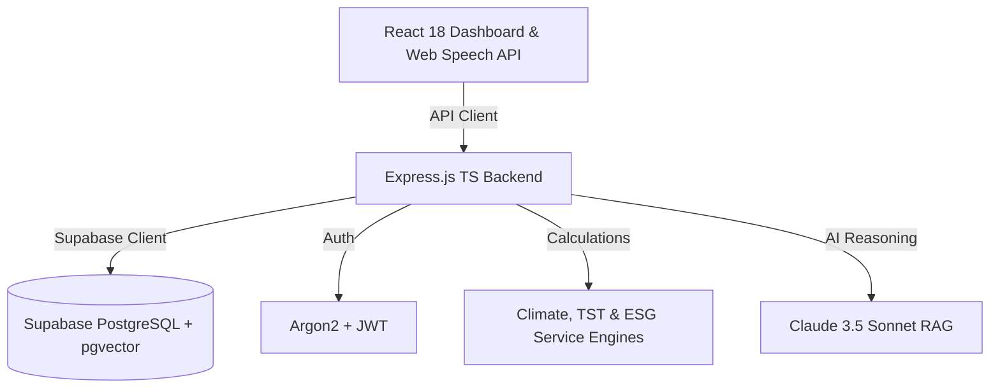

# 🌍 EcoSortha AI (ClimateShield)
> **Enterprise-Grade PaaS for Climate-Resilient Circular Commerce & Heat-Sensitive SME Logistics**

EcoSortha AI (ClimateShield) is a high-maturity, production-ready circular commerce marketplace and decision-intelligence platform engineered to protect and optimize Bangladesh's heat-sensitive SME product sectors (including Agro-biologicals, temperature-sensitive Retail goods, and specialized chemical/biological Manufacturing compounds). By combining real-time IoT fermentation and parameter analytics, neighborhood-specific microclimate modeling (MERM), and a voice-first Bangla RAG assistant, the platform bridges the trust deficit in supply chains and secures delicate physical assets against heat-induced transit spoilage in extreme urban environments.

---

## 🎯 The Strategic Challenge in Bangladesh
Bangladesh's heat-sensitive SME markets—ranging from organic bio-inputs to artisanal retail goods and biological manufacturing compounds—suffer from a severe quality and viability crisis. For instance, in the organic fertilizer sector alone (valued at **BDT 800 Crore annually**), **less than 3% of products carry any verifiable certification**, leaving 97% informally traded. 

Additionally, these biological and chemical products are highly temperature-sensitive. Summer Urban Heat Island (UHI) spikes frequently exceed 36°C, causing **up to 40% active compound degradation** during transport. EcoSortha AI resolves this multi-sided crisis by:
1. **Verifying Batch Quality (At Production):** Through deterministic IoT parameters (like pH, EC, Temp, Fermentation days) mapped to official benchmarks (such as BARI and national standards).
2. **Verifying Transit Viability (At Dispatch):** Through a proprietary Microclimate Exposure Risk Model (MERM) that predicts Thermal Survival Time (TST) for all heat-sensitive shipments.
3. **Overcoming Adoption Barriers:** By offering an inclusive, speech-enabled, natural Bangla RAG interface for semi-literate local operators across sectors.

---

## 🚀 Key Platform Features

### 1. 🌡️ Microclimate Exposure Risk Model (MERM)
Fuses regional weather feeds (Open-Meteo) with neighborhood-specific concrete density, canopy levels, and building indices to predict microclimatic heat risks in narrow urban transit corridors.
*   **Scientific Formula:**
    $$T_{\text{adjusted}} = T_{\text{base}} + (\text{UHI Offset} \times \text{Solar Factor}) - W_{\text{cooling}}$$

### 2. ⏱️ Deterministic Thermal Survival Time (TST) Engine
Predicts exact transit survival windows (in minutes) for sensitive microbial packages based on UHI forecasts, dispatch hours, and packaging insulation ratings.
*   **Scientific Formula:**
    $$\text{TST (minutes)} = \text{Math.max}\left(10, \text{Math.round}\left(\frac{\text{Trust Score} \times \text{Packaging Factor} \times \text{Base Survival Multiplier}}{\text{Hazard Multiplier} \times \text{Solar Hour Multiplier}} \times 60\right)\right)$$
*   *Old Dhaka Peak Test Case:* Standard Plastic (`1.0`), Old Dhaka (`Hazard=1.8`, `Survival=0.9`), Peak Solar (`1.5`), Trust Score (`85`) $\rightarrow$ Resolves to exactly **`1700` minutes**.

### 3. 🔬 BARI-Aligned IoT Trust Score Evaluator
Evaluates production batches (0-100) using deterministic sensor logs (pH, Electrical Conductivity, Temp, Fermentation days) against official BARI benchmarks.

### 4. 📈 30-Day Demand & Temperature Forecaster
Projects seasonal product demand curves alongside UHI extreme heat events, allowing SMEs to buffer stock before heatwaves hit.

### 5. ♻️ Multi-Track ESG Impact Tracker
Aggregates circular transaction metrics to programmatically calculate:
*   **Plastic PET Offsets (kg)** saved via bulk refill containers.
*   **Carbon Sequestration ($CO_2\text{e}$)** programmatically modeled from thermochemical solid carbonization (pyrolysis).
*   **Prevented Spoilage Savings (BDT)** from smart-dispatch compliance.

### 6. 🎙️ Voice-First Bangla RAG Assistant
An inclusive browser speech portal translating natural spoken Bangla queries into LLM prompts grounded in BARI scientific guidelines.

### 7. 🔐 Cryptographic QR Verification Pipeline
Generates downloadable PDF certificates with public verification URLs showing unalterable production histories.

---

## 🛠️ Technology Stack & Architecture

The target product architecture is documented in [docs/ARCHITECTURE.md](docs/ARCHITECTURE.md), with a Mermaid workflow diagram in [docs/recommended-workflow-diagram.md](docs/recommended-workflow-diagram.md). The implementation keeps the existing Render backend and Supabase deployment structure intact while organizing the platform into authenticated commerce, product trust, climate supply chain, AI decisioning, execution, and business intelligence layers.



| Layer | Technologies / Tools |
| :--- | :--- |
| **Frontend UI** | React 18 (Standalone CDN), Vanilla CSS, Chart.js, Babel |
| **Backend Core** | Node.js, Express, TypeScript, ts-node |
| **Database & Vector Store** | Supabase (PostgreSQL with `pgvector` & RLS Policies) |
| **AI & LLM Services** | Groq llama-3 70B API, Web Speech API |
| **Security & Utilities** | jsPDF (Certificate generation), dotenv, Argon2, JSONWebTokens |

---

## 📥 Installation & Local Setup

### Prerequisites
*   Node.js (v18.0.0 or higher)
*   npm (v9.0.0 or higher)

### 1. Clone the Repository
```bash
git clone https://github.com/punam06/EcoWeatherSME.git
cd EcoWeatherSME
```

### 2. Install Workspace Dependencies
```bash
# Installs root and backend dependencies
npm run setup
```

### 3. Configure Environment Variables
Create a `.env` file in the repository root directory matching [`.env.template`](file:///Users/punam/Desktop/Internship%20or%20Courses/Competitions/Current/2026/participation/AI%20buildfest/.env.template):
```bash
cp .env.template .env
```
*Fill in your Supabase connection strings, JWT secrets, and Anthropic/Claude API credentials.*

---

## 🏃 Running the Application

### 🧪 Run the Core Mathematical Test Suite
Verify that all algorithms, formulas (MERM, TST, ESG, Trust Score), and float-rounding logic are 100% accurate:
```bash
npm run test:math
```

### 🚀 Start Development Environment
Launches both Express backend API (Port 5001) and Frontend UI Server (Port 3000):
```bash
npm run dev
```
*   **Frontend Dashboard:** [http://localhost:3000/index.html](http://localhost:3000/index.html)
*   **Backend Health Check:** [http://localhost:5001/api/health](http://localhost:5001/api/health)

### 🧪 Run the Interactive Microclimate Simulation
Evaluate custom parameters (zone, packaging, solar time, pH) via an interactive CLI script:
```bash
npx ts-node scripts/interactive-microclimate.ts
```

---

## 👥 Team & Contributions

Our team organized horizontally using strict branch lifecycles and logical interface contracts to maximize execution velocity:

| Name | Role | Core Contributions |
| :--- | :--- | :--- |
| **Umme Hani Punam** *(Team Lead)* | **Microclimate Data Architect & UI Developer** | Developed the core MERM/TST mathematical service libraries, engineered the TypeScript type interfaces, built the ESG calculator, created the test suites, and developed the standalone frontend dashboard. |
| **Zihad** | **AI Integration & Backend Developer** | Integrated the Voice-to-Text Bangla LLM pipeline and structured the backend microservices. |
| **Orce** | **UI/UX Designer** | Designed the circular SVG viability gauges, formulated responsive layout wires, and specified the voice recorder animations. |
| **Sabbir** | **Database Architect & Cloud Ops** | Configured the Supabase Vector Database, implemented RLS security policies, and managed cloud deployments. |

---

## 📄 Reference & Guides
*   For deployment configurations and secrets setup: See [DEPLOYMENT_NOTES.md](file:///Users/punam/Desktop/Internship%20or%20Courses/Competitions/Current/2026/participation/AI%20buildfest/DEPLOYMENT_NOTES.md)
*   For a complete full-stack integration guide: See [INTEGRATION_GUIDE.md](file:///Users/punam/Desktop/Internship%20or%20Courses/Competitions/Current/2026/participation/AI%20buildfest/INTEGRATION_GUIDE.md)
