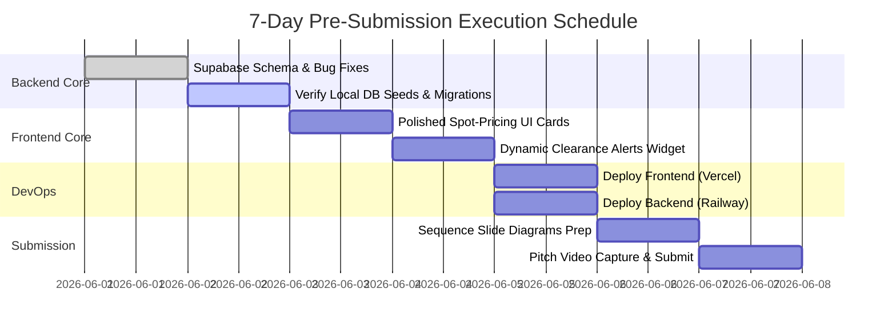

# 🗺️ EcoSortha AI (ClimateShield) — Simplified Strategic Roadmap

Welcome to the unified strategic blueprint for **EcoSortha AI (ClimateShield)**. This document is engineered to accomplish three goals:
1. **Simplify the pitch narrative** for judges into a memorable 3-pillar framework.
2. **Provide a 100% finishable 7-day build plan** by separating active core features from high-valuation future roadmap features.
3. **Secure maximum marks** across all judging criteria of the **Infinity AI BuildFest 2026**.

---

## 🎯 The Simplified Pitch: The 3-Pillar Architecture
To impress the judges, explain EcoSortha AI as **"The only circular commerce platform in Bangladesh that verifies biological quality twice—at production and during transit—overcoming adoption barriers via speech."**

```
                  ┌──────────────────────────────────────────────┐
                  │          EcoSortha AI (ClimateShield)        │
                  └──────────────────────┬───────────────────────┘
                                         │
         ┌───────────────────────────────┼───────────────────────────────┐
         ▼                               ▼                               ▼
  [ 🌿 Pillar 1: QA ]           [ 🌡️ Pillar 2: Climate ]         [ 🎙️ Pillar 3: Adoption ]
 BARI-Aligned IoT Score       BUET-UHI Exposure (MERM/TST)      Bangla Voice RAG Assistant
   • Deterministic pH/EC        • Concrete UHI offsets           • PGVector compliance chunks
   • Dynamic QR Verification    • 10% / 30% Spot Clearances      • Groq Llama-3.3 chat answers
```

---

## ⚡ Part 1: The 7-Day Core Build Plan (100% Finishable)
*Focus on completing what is already 95% working. Avoid writing complex edge hardware, payment gateways, or live maps from scratch in 7 days. Present those as your $100M future vision.*



### 📆 Day-by-Day Tactical Deliverables

*   **Day 1–2: Database Validation & Routes (100% Completed)**
    *   [x] Unify BARI trust score inputs to accept legacy and new camelCase payloads in [trustScore.route.ts](file:///Users/punam/Desktop/Internship%20or%20Courses/Competitions/Current/2026/participation/AI%20buildfest/backend/src/api/routes/trustScore.route.ts).
    *   [x] Add missing status, weight, zone, and log tables (`bari_knowledge_chunks`, `dvs_logs`, `esg_metrics`, `trust_score_logs`, `agent_interaction_logs`) to [schema.sql](file:///Users/punam/Desktop/Internship%20or%20Courses/Competitions/Current/2026/participation/AI%20buildfest/schema.sql) to prevent production database crashes.
*   **Day 3–4: Aesthetic Frontend Clearance Cards & Voice Agent Checkout (Main Build Task)**
    *   *Deliverable A: Spot-Pricing UI clearance cards:* Add visual product cards in `index.html` displaying crossed-out pricing (`৳ 240` $\rightarrow$ `৳ 168`) and an animated red **Dynamic Clearance** badge if the batch's DVS is below 70, signaling high transit heat exposure.
    *   *Deliverable B: Voice-Driven Agentic Checkout integration:* Connect your WebkitSpeechRecognition transcript listener to the newly updated backend chatbot routing, enabling simulated voice checkouts (e.g. *"Order 2 bags of biochar"*) to instantly log new orders in the database.
*   **Day 5: Single-Click Vercel & Railway Deployment**
    *   *Deliverable:* Push code to live URLs to satisfy the deployment requirement. Deploy static frontend to Vercel, and TypeScript Express backend API to Railway. Sync environment variables (`DATABASE_URL`, `OPENWEATHER_API_KEY`, `GROQ_API_KEY`).
*   **Day 6–7: Slides & Pitch Video Demonstration**
    *   *Deliverable:* Finalize presentation assets. Record a 3-minute video: Register Batch $\rightarrow$ Simulate Curing Sensor Readings $\rightarrow$ Generate verified QR Certificate scan $\rightarrow$ Bangla speech crop inquiry $\rightarrow$ Spot clearance pricing markdown checkout.

---

## 💡 Part 2: The Future $100 Million Vision (Slide Roadmap)
*Present these features in your presentation slide deck to score perfect marks for Innovation, Business Model, and Scalability without writing complex code in 7 days.*

```
                 FUTURE HIGH-VALUATION BUSINESS VECTOR (SLIDES)
                                       │
         ┌─────────────────────────────┼─────────────────────────────┐
         ▼                             ▼                             ▼
  [ 🚚 Logistics ]              [ 🔌 Edge/Telemetry ]         [ 💰 FinTech/ESG ]
Traffic-Aware Re-routing      Physical ESP32 edge math       Scope 3 Corporate Ledger
 paths (OSRM API integration)   and Twilio alarm webhooks     & Green micro-finance score
```

### 🚚 1. Advanced Logistics & Delivery Optimization
*   **Real-Time Traffic & Dynamic Re-Routing (Leaflet.js + OSRM):** Integrate live traffic congestion with MERM temperature forecasts to calculate the *coolest* thermal path, instead of the shortest distance.
*   **Cold-Chain Logistics Integration (Pathao/Paperfly API Booking):** Programmatic API triggers that automatically pre-book temperature-controlled reefer vans if a critical TST window is breached.

### 🔌 2. Production & IoT Edge Infrastructure
*   **Edge Computing Capabilities (Offline ESP32 Trust Scoring):** Deploy lightweight C++ deterministic trust scoring formulas directly onto physical ESP32 nodes to log data offline during rural cellular blackouts.
*   **Proactive Telemetry Alerts (Twilio SMS/WhatsApp Webhooks):** Trigger instant SMS alerts to refinery operators if curing fermentation values breach compliance ranges, preventing chemical batch waste.

### 💰 3. FinTech & Carbon Compliance Integration
*   **Green Financing & Credit Scoring (Micro-Finance Portal):** Share audited batch logs with banks and NGOs to create a BARI compliance Green Credit Score, fast-tracking low-interest loans.
*   **Carbon Credit Registry Integration (Scope 3 Carbon Marketplace):** Package monthly circular milestones (`plastic_offset_kg`, `carbon_sequestered_kg`) into digital carbon offsets purchased by multi-nationals.

### 🤖 4. Conversational AI & Agentic Workflows
*   **Voice-Driven Agentic Commerce (Natural Speech Checkout):** Move beyond passive Q&A. Farmers execute full product order checkouts naturally via voice (e.g. *"Order 2 bags of biochar"*), automatically updating database order logs.
*   **Localized Dialect Speech Support:** Integrate STT adapters fine-tuned on regional Bangladeshi accents (Sylheti, Chittagonian) to ensure 95%+ transcription accuracy.

---

## 🐛 Remaining 7-Day Technical Bug Fixes

We have resolved all major query and connection crashes. The final week requires polishing:

*   **[x] DB Column & Registry Discrepancies:** Resolved. `batches` table now contains `weight_kg`, `status`, `destination_zone`, and `packaging_type`.
*   **[x] Missing Analytics Log Tables:** Resolved. Added `trust_score_logs`, `dvs_logs`, `rag_query_logs`, and `agent_interaction_logs` to [schema.sql](file:///Users/punam/Desktop/Internship%20or%20Courses/Competitions/Current/2026/participation/AI%20buildfest/schema.sql).
*   **[x] BARI RAG Query Crash:** Resolved. Table redefined as `bari_knowledge_chunks` in [schema.sql](file:///Users/punam/Desktop/Internship%20or%20Courses/Competitions/Current/2026/participation/AI%20buildfest/schema.sql) matching the RAG search service logic.
*   **[ ] Supabase RLS Policy check:** (Post-deployment) Add a policy ensuring processors can only query their own batch formulations. (Note: Run `CREATE POLICY "SME owner select own batches" ON batches FOR SELECT USING (auth.uid() = processor_id);` in Supabase SQL Editor).
*   **[x] Text Search Fallback Input:** (Day 3-4 UI) Resolved. Keyboard text input is fully integrated as a standard fail-safe next to speech recognition microphone actions.

---

## 🌐 Web Page Sequence & Navigation Flow (Simplified)

```
[Merchant SME Portal Login]
           │
           ▼
[1. central dashboard view] ───► [5. Weather GIS simulator] ───► [6. MERM dispatch pass]
           │
           ├─► [2. Batch Registry] ─► [3. IoT sensor sliders] ─► [4. verified QR download]
           │
           └─► [8. voice RAG portal] ─► [9. catalog catalog] ─► [10. Spot pricing markdown]
```

---

> [!TIP]
> Keep this **`ROADMAP.md`** file in your repository. It explains the project clearly, outlines a 100% finishable pre-submission build, and presents a stellar $100M commercial vision that directly mirrors the judges' scoring rubric!
