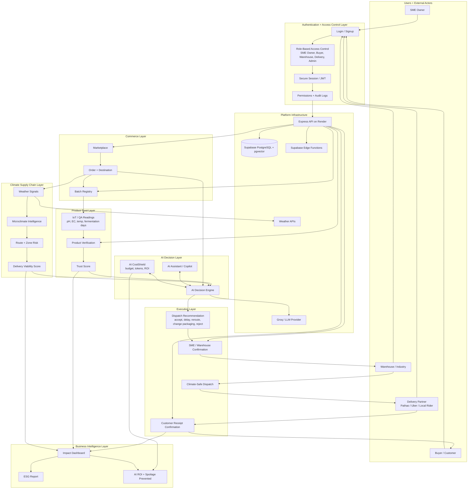

# ClimaLogix ClimateShield Recommended Workflow

This diagram upgrades the product from a module dashboard into an SME operating system:

- Commerce handles orders, products, customers, and batch registration.
- Product Trust verifies whether a batch is safe and credible.
- Climate Supply Chain checks whether the batch can survive the delivery route and time window.
- AI Decision Layer recommends the next operational action.
- AI CostShield makes sure AI usage stays within budget and proves ROI.
- Authentication and access control protect each workflow by role: SME owner, buyer, warehouse, delivery partner, and admin.
- Business Intelligence turns successful decisions into ESG, savings, and growth metrics.

## Pitch Version

ClimaLogix ClimateShield connects authenticated commerce, product trust, weather intelligence, and climate-safe logistics into one SME operating layer. Every order is checked against user permissions, batch quality, and route climate risk before dispatch. The AI Decision Engine recommends whether to accept, delay, reroute, improve packaging, or reject a delivery. AI CostShield keeps the SME protected from uncontrolled token spending by linking every AI call to business ROI.
